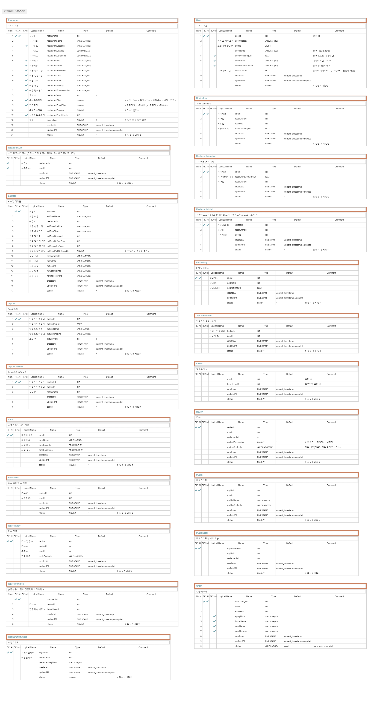

# MangoPlate APP Clone Project

## :melon: MangoPlate Clone project에 사용된 백엔드 코드 저장소 입니다.

---
## 🏠  팀원
* [(Radi) 황상연](https://github.com/WhiteRadish-Hwang) : 프론트엔드 개발
* [(Lake) 황성준](https://github.com/sungjun1116) : 백엔드 개발
* [(Andrew)이유상](https://github.com/liyusang1) : 백엔드 개발
---
## 🛠 개발 환경
>AWS EC2에서 Node를 통해 서버를 구동하고 AWS RDS를 사용.

 


---

```text
소프트스퀘어드 노드 템플릿은 Node, Express Framwork, MVC (Route, Controller)으로 구성되어있고,
데이터베이스 모듈(= 라이브러리)는 mysql2 을 사용하여 DB와 통신하고있다. 설정파일은 /config/database.js 에 있다.

그리고 winston 이라는 모듈와 winston-daily-rotate-file 이라는 모듈 사용하여 Logger (=/config/winston.js) 를 구축해놓았다.
Firebase나 토큰이나 누군가에게 공개해선 안되는 키값들은 /config/secret.js 라는 곳에 모아놓고있다.

jwt 는 /config/jwtMiddleware.js 에서 검증을 jwtMiddleware 라는 자체모듈로 만들어서 사용하고있다. 이거는 route 파일에서 체이닝 방식으로 사용하고있다. (예제는 /app/routes/* 에 있는 파일을 참고하면 된다.)

express 는 /config/express.js 에 설정 값들이 모여있다. 
기본 설정들은 해놓았는데 필요한 설정이 있다면 이 파일로 가서 추가/수정/삭제를 하면 된다.
```

---
## :calendar: 프로젝트 기간

```
2021-02-03 ~ 2021-02-17
```

---
## :computer: ERD 설계도
> AQueryTool 이용



## :memo: API Sheet

>https://docs.google.com/spreadsheets/d/17y8Ly1hpqzqV-CuqsH1wEuEXZfPlo-qTFa1UVrqtv7Y/edit?usp=sharing

|기능|Method|URL|
|:---|:---:|:---:|
|카카오 로그인|POST|/kakao-login|
|페이스북 로그인|POST|/facebook-login|
|사용자 프로필 조회|GET|/users/:userId|
|내정보 수정|PATCH|/users/:userId?userinfofilter|
|식당 상세 조회|GET|/restaurants/:restaurantId|
|식당 사진 상세 조회|GET|/reviews/images/:imgId|
|가봤어요 조회|GET|/restaurants/:restaurantId/visited|
|가봤어요 등록|POST|/restaurants/:restaurantId/visited?status=1|
|식당 등록|POST|/restaurants|
|식당 가고싶다 추가, 해제|PATCH|/restaurants/:restaurantId/like|
|소식 조회|GET|/reviews?page=0&limit=10&locationfilter=1&expressionfilter=1|
|리뷰 상세 조회|GET|/reviews/:reviewId|
|리뷰 작성|POST|/reviews|
|리뷰 수정|PATCH|/reviews/:reviewId|
|리뷰 삭제|PATCH|/reviews/:reviewId/status|
|리뷰 좋아요 추가, 해제|PATCH|/reviews/:reviewId/like|
|리뷰 댓글 작성|POST|/reviews/:reviewId/replies|
|리뷰 댓글 수정|PATCH|/reviews/:reviewId/replies/:replyId|
|리뷰 댓글 삭제|PATCH|/reviews/:reviewId/replies/:replyId/status|
|잇딜 조회|GET|/eat-deals?page=0&limit=30&locationfilter=1&locationfilter=2|
|모든 잇딜 조회|GET|/eat-deals-all?page=0&limit=30|
|잇딜 정보 상세 조회|GET|/eat-deals/:eatDealId|
|탑리스트 전체조회|GET|/top-list?page=0&limit=10|
|탑리스트 상태 변경|PATCH|/top-list/:topListId|
|탑리스트 상세 조회|GET|/top-list/:topListId?page=0&limit=10|
|팔로워 목록 조회|GET|/users/:userId/follower|
|팔로잉 목록 조회|GET|/users/:userId/following|
|팔로우 상태 변경|PATCH|/following/users/:userId|
|주문번호 생성|POST|/payments|
|결제 검증|GET|/payments/complete?imp_uid=imp_12345678&merchant_uid=oid_987654321&imp_success=true|
|결제 목록 조회|GET|/payments/users/:userId|
|회원 탈퇴|PATCH|/users/:userId/status|
|내 주변 잇딜 조회|GET|/eat-deals/users?userlatitude=37.6511723&userlongtitude=127.0481563&page=0&limit=30|

|기능|Method|URL|
|:---|:---:|:---:|
|식당 전체 조회|GET|/restaurants?page=0&limit=10&locationfilter=1&locationfilter=2&distance=4000&sort=1&userLatitude=37.6511723&userLongitude=127.0481563|
|식당 검색|GET|/search-restaurants?page=0&limit=30&locationfilter=1&locationfilter=2&locationfilter=3&userLatitude=37.6511723&userLongitude=127.0481563|


## :movie_camera: 시연 영상
> https://www.youtube.com/watch?v=17xm5eXG_XQ&feature=youtu.be
---
# :iphone: 실행 화면


### 로그인

  

---

### 음식점 찾기

 

---

### 음식점 상세조회


   

---
### 소식

 

---

### EAT DEAL

  

---

### 식당 등록

 

---

### TOP List


---

### 내 정보

 

---

## :warning: License

본 템플릿은 소프트스퀘어드에 소유권이 있으며 본 자료에 대한 상업적 이용 및 무단 복제,배포 및 변경을 원칙적으로 금지하며 이를 위반할 때에는 형사처벌을 받을 수 있습니다.
